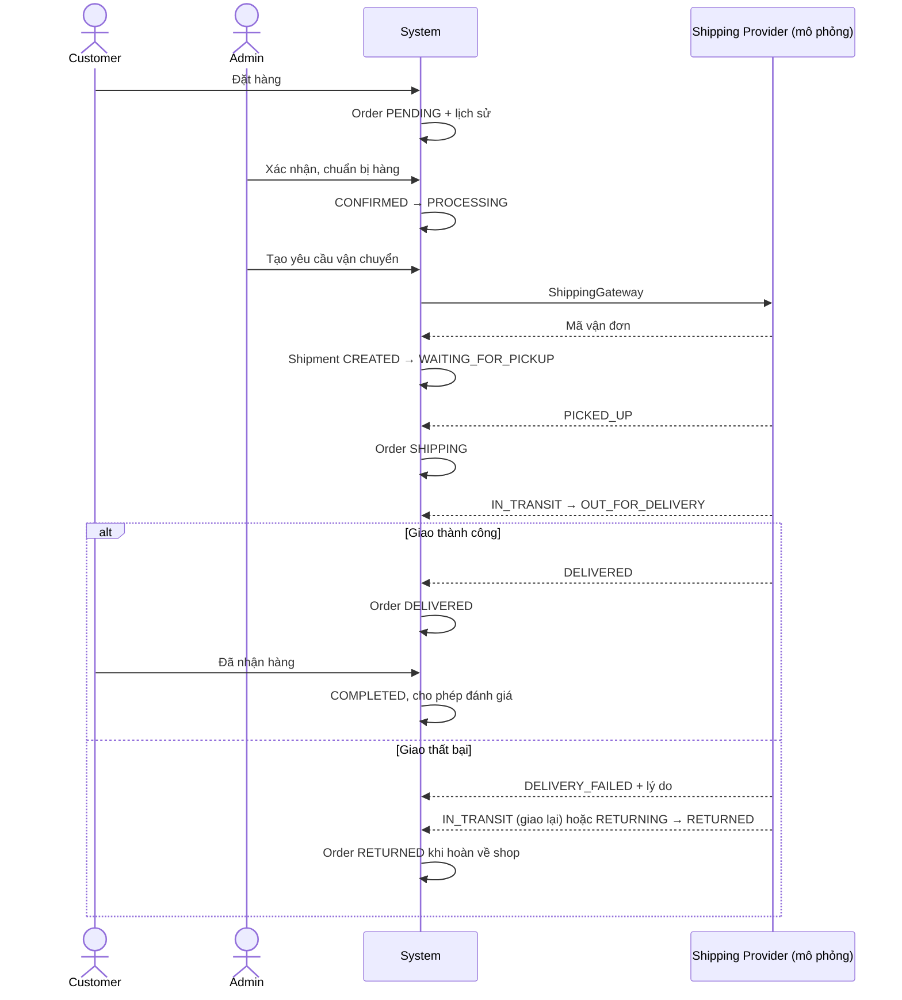
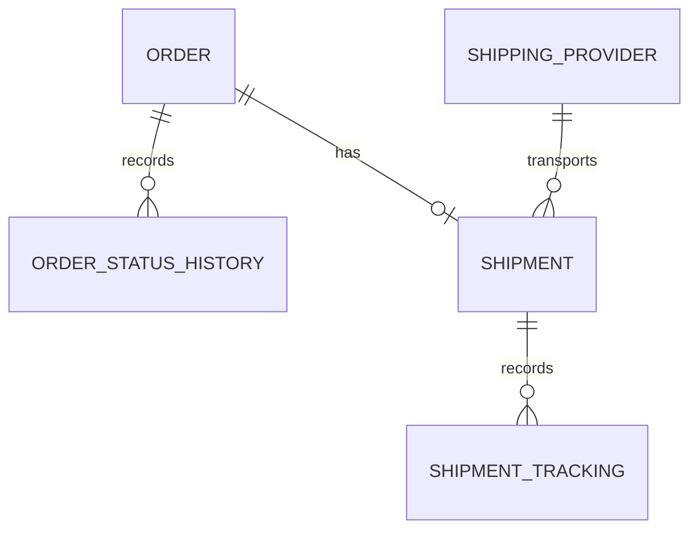

# Luồng đơn hàng và vận chuyển

Hệ thống có Customer và Admin. GHN, GHTK, Viettel Post là dữ liệu đơn vị vận chuyển, không phải tài khoản hoặc role SHIPPER. Mỗi đơn hàng có tối đa một vận đơn.

## Chạy demo

Khởi động lại Spring Boot để tự chạy `shipping-migration.sql` trước khi Hibernate kiểm tra schema PostgreSQL. Migration tạo bảng mới, chỉ mục và ba đơn vị vận chuyển; chạy lặp lại được, không xóa dữ liệu hiện có. Dữ liệu lịch sử bắt đầu được ghi từ các thao tác mới, không tự bịa lịch sử cho đơn cũ.

1. Customer đặt hàng qua giỏ hàng hoặc mua ngay: PENDING và lịch sử đặt hàng.
2. Admin vào Quản lý đơn hàng, chọn đơn, xác nhận CONFIRMED rồi chuẩn bị PROCESSING.
3. Nhập đơn vị vận chuyển, khối lượng kg, phí và ngày dự kiến (tùy chọn), bấm Tạo đơn vận chuyển.
4. Bấm Bàn giao hàng (PICKED_UP). Simulator chạy mỗi 5 giây, đi lần lượt qua các điểm của tuyến đã lưu và tự chuyển IN_TRANSIT → OUT_FOR_DELIVERY → DELIVERED.
5. Customer vào Chi tiết đơn hàng để xem tuyến đường, xe và timeline; màn hình tự tải lại mỗi 5 giây khi đang chờ lấy hàng hoặc đang giao.
6. Sau DELIVERED, Customer bấm Đã nhận hàng để chuyển COMPLETED và mở đánh giá.
7. Có thể thử giao thất bại (bắt buộc lý do), giao lại hoặc hoàn về shop (RETURNED).

Phí trên vận đơn là phí của yêu cầu vận chuyển; tổng tiền khách đã chốt ở checkout không bị thay đổi. RETURNED ghi nhận kết quả hoàn hàng; hoàn tiền/kiểm đếm và nhập kho hàng hoàn cần nghiệp vụ xử lý riêng, không tự thực hiện tại callback.

## API

| Phương thức | Đường dẫn | Quyền |
| --- | --- | --- |
| GET | `/api/admin/shipping-providers` | Admin |
| GET / POST | `/api/admin/orders/{id}/shipment` | Admin: xem / tạo |
| PATCH | `/api/admin/orders/{id}/shipment/simulate` | Admin mô phỏng phản hồi ĐVVC |
| GET | `/api/orders/{id}/shipment` | Customer sở hữu đơn |
| PATCH | `/api/orders/{id}/receive` | Customer sở hữu đơn đã giao |

Tạo vận đơn: `{ "providerId": 1, "weightKg": 1.2, "shippingFee": 30000, "estimatedDelivery": "2026-09-25" }`.
Cập nhật: `{ "status": "DELIVERY_FAILED", "description": "Không liên hệ được người nhận", "location": "Hà Nội" }`.

`ShippingGateway` là điểm thay adapter mô phỏng bằng API hãng vận chuyển. Chưa kết nối API hãng thật; chưa công khai webhook. Callback thật sau này cần xác thực nguồn trước khi gọi nghiệp vụ cập nhật. Giao dịch tạo/cập nhật khóa đơn hàng để tránh tạo hai vận đơn hoặc cập nhật đồng thời; trạng thái lặp lại không tạo thêm sự kiện.

## Sơ đồ nghiệp vụ

## Kiểm tra

`mvn -Dtest=ShipmentFlowTest,AdminOrderServiceTest,OrderServiceTest,CheckoutServiceTest,OrderReceiptTest,ReviewEligibilityTest test`

`cd frontend` rồi `npm run build` và `npm run lint`.

`scripts/system-smoke-test.mjs` đã cập nhật để đi qua vận đơn và khách xác nhận nhận hàng, cần hệ thống demo đang chạy.

## Bản đồ, địa chỉ và tuyến đường thực

Checkout: nhập địa điểm → bấm Tìm kiếm/Enter → chọn kết quả để bản đồ bay tới zoom 17 → kéo bản đồ dưới ghim cố định → đợi địa chỉ → Xác nhận địa chỉ. Khi sửa địa chỉ hoặc di chuyển bản đồ, tọa độ đã xác nhận bị xóa để tránh đặt hàng với vị trí cũ. Có thể bấm Lấy địa chỉ tại ghim để chọn vị trí mặc định hoặc thử lại sau lỗi.

- `GET /api/location/search?q=...`: tìm địa chỉ tại Việt Nam, cần đăng nhập, 3–200 ký tự.
- `GET /api/location/reverse?lat=...&lng=...`: trả địa chỉ và giữ nguyên tọa độ người dùng đã chọn.
- Tracking trả thêm `route: [{latitude, longitude}, ...]`.
- Tạo vận đơn gọi OSRM một lần, lưu toàn bộ hình học GeoJSON theo thứ tự vào `shipment_route_points`. Không có tuyến hợp lệ thì tạo vận đơn thất bại và transaction rollback; không thay bằng đường thẳng.
- Simulator chỉ bắt đầu sau bàn giao; mỗi tick tiến một điểm. Các mốc IN_TRANSIT (10%), OUT_FOR_DELIVERY (80%), DELIVERED (100%) tính theo chỉ số điểm, không phải thời gian giao thực. Tuyến rất ngắn vẫn đi đủ các trạng thái qua nhiều tick. Giao thất bại/hoàn hàng không tự chạy.
- Vận đơn cũ thiếu tuyến không tự chạy. Admin cập nhật trạng thái tiếp theo sẽ lấy và lưu tuyến một lần; không tự bịa lại lịch sử.
- Khởi động lại backend để chạy migration tạo bảng tuyến. Schema trong `database/schema.sql` cũng đã được bổ sung.

### Cấu hình dịch vụ

| Biến môi trường | Mặc định | Công dụng |
| --- | --- | --- |
| `GEOCODING_PROVIDER` | `photon` | `photon` hoặc `nominatim` |
| `GEOCODING_URL` | `https://photon.komoot.io` | URL tương ứng với provider đã chọn |
| `ROUTING_URL` | `https://router.project-osrm.org` | OSRM hoặc máy chủ OSRM tự triển khai |
| `MAPS_USER_AGENT` | `FashionShopDemo/1.0` | Nên đặt tên ứng dụng kèm URL/email liên hệ khi triển khai |
| `SHIPPING_SIMULATOR_ENABLED` | `true` | Tắt mô phỏng khi tích hợp hãng thật |

Mặc định dùng [Photon](https://github.com/komoot/photon) cho tìm kiếm và reverse geocoding. Để dùng Nominatim, đặt cả `GEOCODING_PROVIDER=nominatim` và `GEOCODING_URL=https://nominatim.openstreetmap.org`, rồi khởi động lại backend. Các dịch vụ công cộng chỉ phù hợp demo ít người dùng: tìm kiếm bằng thao tác bấm, không autocomplete. Backend cache tối đa 1.000 kết quả trong 24 giờ, tuần tự hóa và giới hạn tối đa 1 request/1,1 giây cho toàn bộ tiến trình; yêu cầu vượt giới hạn nhận thông báo thử lại. Reverse geocoding debounce 750 ms và bỏ kết quả cũ khi người dùng di chuyển tiếp. Đây là giới hạn cho một instance; khi mở rộng nhiều instance cần provider riêng hoặc bộ giới hạn dùng chung. Không gửi tên/số điện thoại người nhận vào ô tìm địa điểm.

Tuân thủ [Nominatim usage policy](https://operations.osmfoundation.org/policies/nominatim/) và [OSM tile usage policy](https://operations.osmfoundation.org/policies/tiles/). Máy chủ demo công cộng không bảo đảm tính sẵn sàng; production nên dùng provider phù hợp. Routing theo [OSRM API](https://project-osrm.org/docs/v5.24.0/api/) (tọa độ nhà cung cấp là longitude, latitude).

Báo cáo: bản đồ, địa chỉ và tuyến đường là dữ liệu thực từ nhà cung cấp; vị trí xe được mô phỏng theo tuyến, chưa phải GPS của hãng vận chuyển.

Kiểm thử bổ sung: `mvn -Dtest=MapServicesTest,ShipmentFlowTest test`. Test dùng provider giả lập, không gọi dịch vụ bản đồ công cộng.
